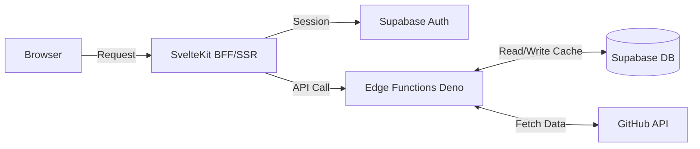

# Slightly Better GH Search

> Enhanced GitHub Code Search with advanced lightweight filtering capabilities.

🔗 **Live Site**: <https://slightly-better-gh-search.vercel.app/>

## 🚀 Features

- **Dual Input System**: Combine standard GitHub search queries with custom
  filter expressions.
- **Filtering**: Evaluate repository attributes (e.g.,
  `stars > 100 && language == 'js'`) using safe filter evaluation (`filtrex`).
- **Authentication**: GitHub OAuth via Supabase Auth with secure token storage
  in Supabase Vault.
- **API Proxy & Caching**: Custom Supabase Edge Function to proxy GitHub API
  requests, utilizing Supabase DB for request caching.

## 🏗️ Architecture



_For deeper insights into architectural decisions, please refer to the
[`docs/adr/`](./docs/adr/) directory._

## 💻 Tech Stack

- **Frontend**: SvelteKit 5, Tailwind CSS
- **Backend / API Proxy**: Supabase Edge Functions (Deno)
- **Database & Cache**: Supabase PostgreSQL
- **Authentication**: Supabase Auth (GitHub OAuth)
- **Deployment & CI/CD**: GitHub Actions, Vercel (Frontend), Supabase
  (Backend/DB)

## � File Structure

The project is split into the frontend application and the backend platform:

```text
.
├── src/                # SvelteKit Application (Frontend)
│   ├── lib/            # Shared UI components, utilities, and states
│   └── routes/         # Page routes (+page.svelte, server loaders)
├── supabase/           # Supabase Platform (Backend)
│   ├── functions/      # Edge Functions (Node/Deno APIs proxying GitHub)
│   ├── migrations/     # Database schemas, RLS policies, and triggers
│   └── tests/          # Database tests (pgTAP)
└── docs/               # Architecture records (ADR) and guides
```

## �🛠️ Getting Started

### Prerequisites

- Node.js 18+ (Use `pnpm`)
- GitHub OAuth Application credentials (for local dev)

### Environment Setup

Environment variables are managed via template files. Copy the templates to set
up your local environment:

```bash
# For SvelteKit (Frontend)
cp .env.example .env

# For Supabase Edge Functions (Backend)
cp supabase/.env.example supabase/.env

# (Optional) Only required for running test suites
cp supabase/.env.test.example supabase/.env.test
```

_Make sure to fill in the copied `.env` and `.env.test` files with your
respective keys and local Supabase URLs._

### Local Development

1. Install dependencies:
   ```bash
   pnpm install
   ```

2. Start the local Supabase instance:
   ```bash
   pnpm supabase start
   ```

3. Start the Edge Functions locally:
   ```bash
   pnpm supabase functions serve
   ```

4. Run the SvelteKit development server:
   ```bash
   pnpm dev
   ```

## 🧪 Testing

The project includes automated tests for backend functions and the database
layer. _(Frontend SvelteKit tests are not currently implemented)._

- **Supabase Edge Functions**: Run Deno-based tests against the local Supabase
  edge functions:
  ```bash
  pnpm test:supabase
  ```

- **Database (pgTAP)**: Run database schema, RLS, and trigger tests:
  ```bash
  pnpm supabase test db
  ```

## ☁️ Deployment

Deployments are fully automated via **GitHub Actions**. For initial setup
instructions (Supabase, Vercel), please see the
[Manual Setup Guide](./docs/manual-setup.md).

- **Frontend**: Pushes to `main` seamlessly trigger a Vercel deployment.
- **Backend**: Changes inside the `supabase/` directory trigger a Supabase CLI
  deployment to update Edge Functions and Database migrations.

### GitHub Actions Secrets

To enable automated deployments, the following secrets must be configured in
your GitHub repository's **Settings > Secrets and variables > Actions**:

| Secret Name             | Description                                                                                                       |
| ----------------------- | ----------------------------------------------------------------------------------------------------------------- |
| `SUPABASE_ACCESS_TOKEN` | Personal access token for the Supabase CLI. Generate this from your Supabase Dashboard (Account > Access Tokens). |
| `SUPABASE_PROJECT_ID`   | Your Supabase project reference ID (e.g., `abcdefghijklmnopqrst`). Found in Project Settings > General.           |
| `SUPABASE_DB_PASSWORD`  | The password for your Postgres database, required for running migrations.                                         |

_Note: Frontend environment variables (like `PUBLIC_SUPABASE_URL`) should be
configured in your Vercel project settings._

## 📚 Documentation

- **Manual Setup & Deployment Guide**:
  [`docs/manual-setup.md`](./docs/manual-setup.md)
- **Architecture Decisions**: [`docs/adr/`](./docs/adr/)
- **Troubleshooting**: [`docs/troubleshooting/`](./docs/troubleshooting/)
- **Development Patterns**: Refer to `GEMINI.md` for AI context/patterns and
  `DEV_LOG.md` for implementation logs.

## 📄 License

MIT
